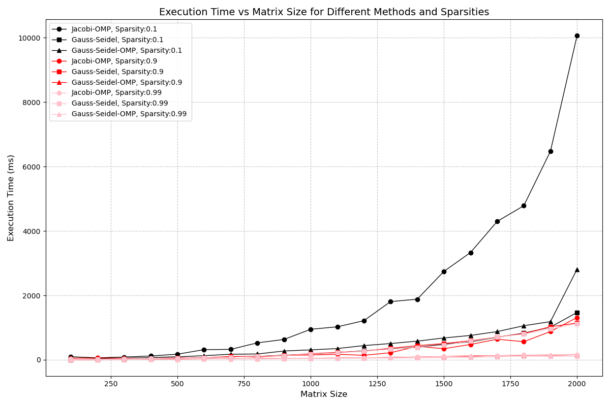
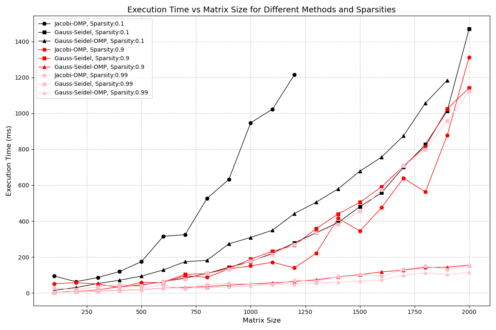
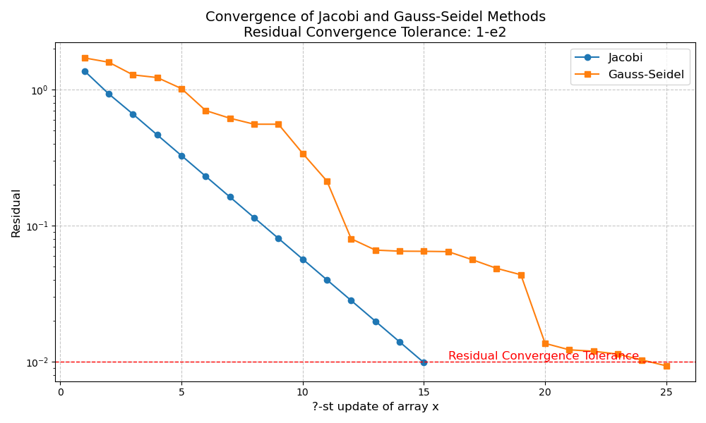
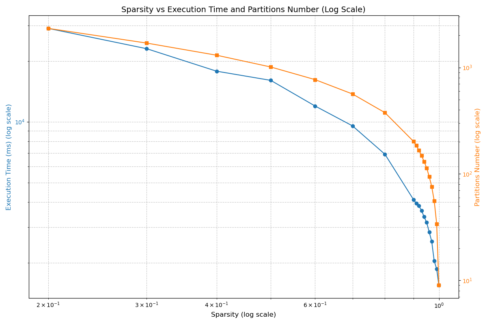
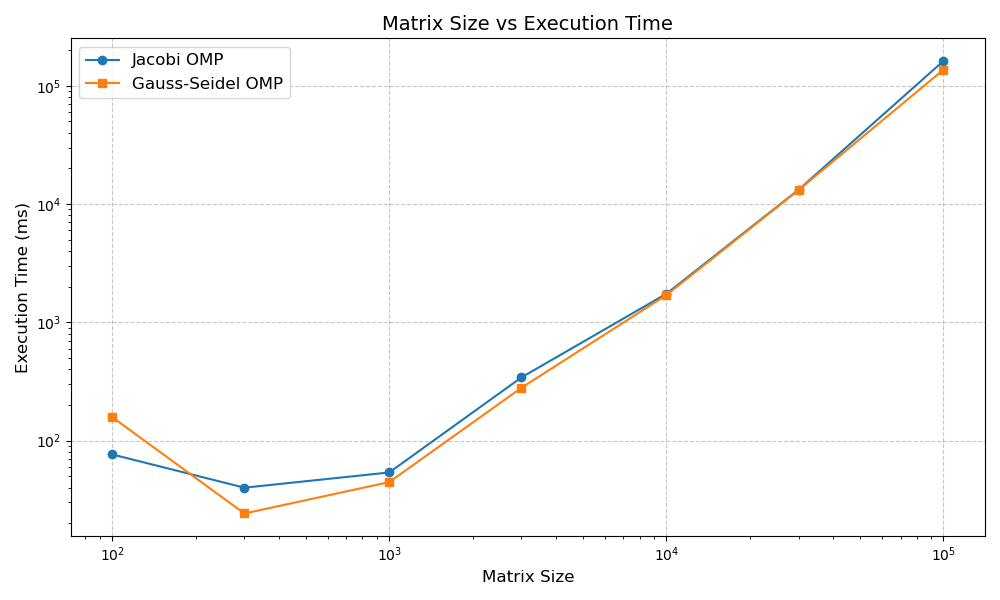
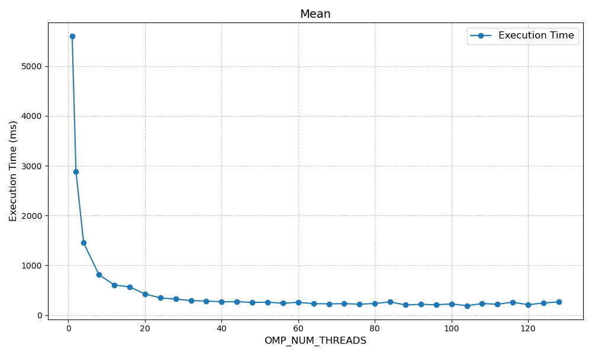
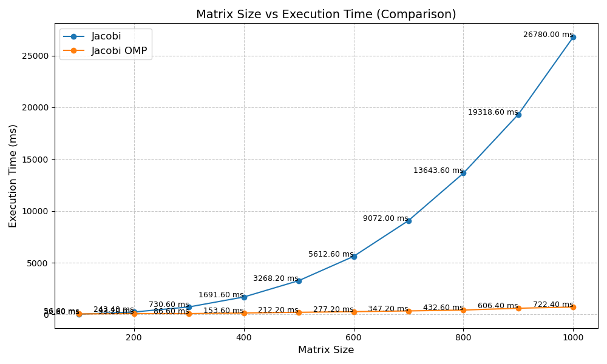

# HPC Project

## Compilation Instructions

To compile the project, use the following command:

```sh
g++ main.cpp lib/gauss.cpp lib/jacobi.cpp  -I./lib lib/residual.cpp lib/gen_random.cpp lib/coloring.cpp lib/print_time.cpp -o main.out -fopenmp 
```

## Usage
To run the program, use the following command:

```sh
./main <flags> <matrix_size> <sparse_ratio> [-v]
```

- **flags**: A 4-digit string containing only `0`s and `1`s, where each digit corresponds to a method.
- **flag example**: `0101` stands for run experiment for `jacobi_omp` and `gauss_seidel_omp`
- **methods**: `jacobi`, `jacobi_omp`, `gauss_seidel`, `gauss_seidel_omp`
- **matrix_size**: The size of the matrix to be processed.
- **sparse_ratio**: The ratio of sparsity in the matrix.
- **-v**: (Optional) Enable verbose mode.

### Example

To run the program with `jacobi` and `gauss_seidel` methods, matrix size is `1000*1000` sparsity is `0.1`:

```sh
./main 1010 1000 0.1 -v
```

### Batch Script and Data Analysis

There are several experiments listed in [result](result) directory, get results and analysis them by running following commands


```sh
# Batch run experiment, 5 times on each configuration
bash [experiment_name]/batch.sh 
# Get mean value of result from 5 repeatations
python [experiment_name]/get_mean.py
# Plot figure
python [experiment_name]/draw.py 
```


### Residual Caculation
residual caculation is time_consuming, here is the setting 

| Method      | Residual Calculation Condition                                   |
|-------------|------------------------------------------------------------------|
| jacobi      | every 10 iterations                           |
| jacobi_omp  | every 10 iterations                           |
| gauss       | when `(iter * n + i) % 100 == 0`                |
| gauss_omp   | when `(iter * partitions_size + current_partition_index) == 0` |

# Figure Explanations

- **Note**: All experiment except `convergence` are repeated 3 times to get mean value.
## 1. Comparision betweenn Jacobi OMP, Gauss-Seidel and Gauss-Seidel OMP [experiment result folder](result/compare_jacobiomp_gauss_gaussomp)
### Normal size figure with all data points   


### Enlarge the main part of the figure by removing some data points (of Jacobi OMP) of which execution times > 1500ms   

- **3 Methods**: Jacobi OMP, Gauss-Seidel and Gauss-Seidel OMP
- **3 Sparsity**: 0.1, 0.9, 0.99

## 2. convergence [experiment result folder](result/converge)


For Jacobi and Gauss-Seidel methods, the array `x` gets updated at different frequencies. The table below explains the residual update frequency for each method:

| Method        | Residual Update Frequency                              |
|---------------|-----------------------------------------------|
| Jacobi        | End of every iteration (`? = iteration_number`)          |
| Gauss-Seidel  | After any `x_i` is updated (`? iteration_number * n + i`) |

- **Matrix**: use same matrix for 2 methods, size is 10*10 
- **Log File**: [result/converge/matrix_size_10.txt](result/converge/matrix_size_10.txt)
- **Note**: Residual calculation is resource consuming, so for other experiments, we used a differnt residual calculation frequency mentioned in [Residual Calculation](#Residual-Caculation)


## 3. Gauss-Seidel OMP: Partition Number and Execution time with Different Sparsity [experiment result folder](result/gaussomp_partition_numbers_sparsity)  


- **Matrix**: size is 10000*10000


## 4. Jacobi OMP and Gauss-Seidel OMP Scability Test with Fixed Sparsity: 0.99999 [experiment result folder](result/jacobi_omp_and_gauss_omp_scability_test_on_very_sparse_matrix)


- **Sparsity**: 0.9999

## 5. Jacobi OMP with Different Threads Number [experiment result folder](result/jacobi_omp_different_threads)


- **Matrix**: different matrix, size is 600*600
- **Sparsity**: 0, means no sparsity


## 6. Jacobi and Jacobi OMP with Different Matrix Size [experiment result folder](result/jacobi_vs_jacobi_omp_different_size_of_matrix)

- **Matrix**: use same matrix for 2 methods, size varies
- **Thread for OMP**: 128
