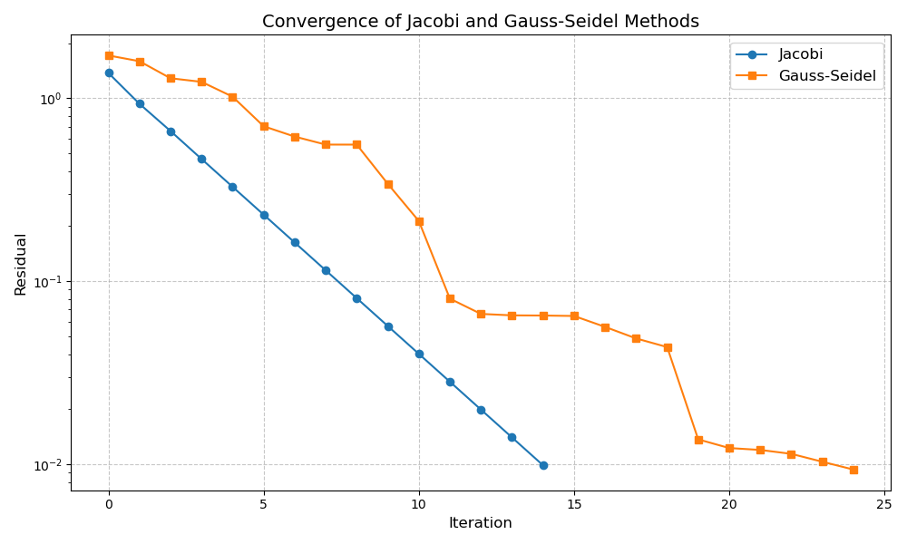

# HPC Project

## Compilation Instructions

To compile the project, use the following command:

```sh
g++ main.cpp lib/gauss.cpp lib/jacobi.cpp  -I./lib lib/residual.cpp lib/gen_random.cpp lib/coloring.cpp lib/print_time.cpp -o main.out -fopenmp 
```

## Usage
To run the program, use the following command:

```sh
./main <flags> <matrix_size> <sparse_ratio> [-v]
```

- **flags**: A 4-digit string containing only `0`s and `1`s, where each digit corresponds to a method.
- **flag example**: `0101` stands for run experiment for `jacobi_omp` and `gauss_seidel_omp`
- **methods**: `jacobi`, `jacobi_omp`, `gauss_seidel`, `gauss_seidel_omp`
- **matrix_size**: The size of the matrix to be processed.
- **sparse_ratio**: The ratio of sparsity in the matrix.
- **-v**: (Optional) Enable verbose mode.

### Example

To run the program with `jacobi` and `gauss_seidel` methods, matrix size is `1000*1000` sparsity is `0.1`:

```sh
./main 1010 1000 0.1 -v
```

### Batch Script Usage

To use the batch shell script, ensure you are in the `hpc_project` directory and execute the following command:

```sh
bash result/***.sh
```

### Figure Plotting

Use python script in the root directory to generate figures, be carefull about data preprocessing

### Residual Caculation (#residual_caculation)
residual caculation is time_consuming, here is the setting 

| Method      | Residual Calculation Condition                                   |
|-------------|------------------------------------------------------------------|
| jacobi      | every 10 iterations                           |
| jacobi_omp  | every 10 iterations                           |
| gauss       | when `(iter * n + i) % 100 == 0`                |
| gauss_omp   | when `(iter * partitions_size + current_partition_index) == 0` |

# Figure Explanations



### Figure Explanations

For Jacobi and Gauss-Seidel methods, the array `x` gets updated at different frequencies. The table below explains the residual update frequency for each method:

| Method        | Residual Update Frequency                              |
|---------------|-----------------------------------------------|
| Jacobi        | End of every iteration (`? = iteration_number`)          |
| Gauss-Seidel  | After any `x_i` is updated (`? iteration_number * n + i`) |

The frequency is differnt with the residual calculation frequency mentioned in the section [Residual Calculation](#residual_caculation)


# 主标题

[跳转到子标题](#子标题)

## 子标题

这是子标题的内容。

[跳转回主标题](#主标题)
